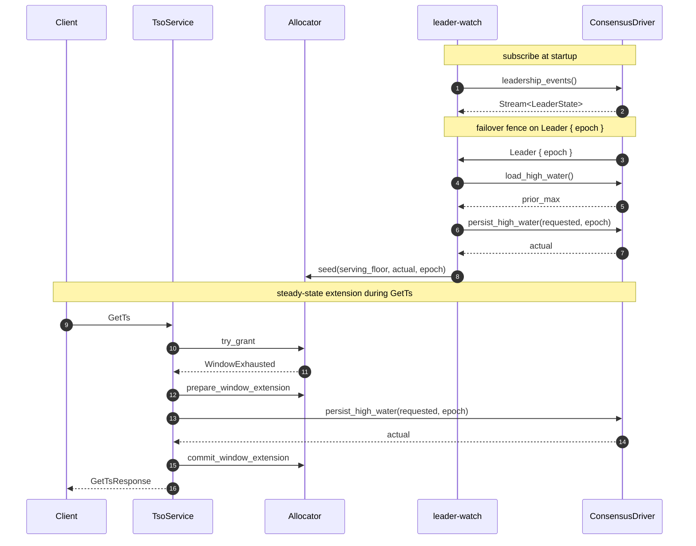

# Consensus Integration

`ConsensusDriver` is tsoracle's single pluggable trait — implement it and you can run tsoracle on top of openraft, raft-rs, etcd, or any other replicated log. This chapter is both the trait reference and a how-to: each of the three methods has its own subsection covering the contract and per-driver implementation recipes, plus a worked end-to-end sketch and an explanation of why single-writer is irreducible.

## The ConsensusDriver trait

The `ConsensusDriver` trait in `tsoracle-consensus` is the single injection point for HA and durable persistence. Three methods, about fifty lines of trait surface:

- [`leadership_events`](#leadership_events) — emit leader-state transitions
- [`load_high_water`](#load_high_water) — read the durable high-water, linearized
- [`persist_high_water`](#persist_high_water) — advance the durable high-water, monotonically, fenced by epoch

Code lives in `crates/tsoracle-consensus/src/lib.rs`.

## leadership_events

Return a `Stream<Item = LeaderState>` that emits transitions for the lifetime of the driver. The first item is the current state at the time the stream is subscribed; subsequent items reflect transitions. Use `tokio::sync::watch` + `tokio_stream::wrappers::WatchStream` for the canonical implementation. The server consumes one stream per driver and holds it forever.

`LeaderState::Leader { epoch }` means this node is the elected leader at the named epoch. The epoch is opaque to the library; drivers typically map it to the consensus layer's term or lease generation. `LeaderState::Follower { leader_endpoint }` means this node is a follower; if `leader_endpoint` is `Some`, the value is the *advertised tsoracle service address* of the current leader (NOT its raft / consensus address). `LeaderState::Unknown` means the driver does not currently know who is leader (election in progress, network partition, etc.).

## load_high_water

Return the durably-persisted high-water. The read MUST be linearized — the returned value must reflect all writes that durably committed before this call started, from any prior leader at any prior epoch. This is the contract the failover fence (see [The failover fence](key-subsystems.md#the-failover-fence) and [Monotonicity proof](the-allocator.md#monotonicity-proof)) depends on.

Per-driver recipes:

- **openraft:** call `Raft::ensure_linearizable(ReadPolicy::ReadIndex)` and read the high-water field from the state machine after the barrier passes.
- **raft-rs:** issue a `ReadIndex` request, wait for the returned index to be applied, read from the state machine.
- **etcd:** read with `--consistency=l` (linearizable, the default).
- **Single-node:** read the in-memory cache or the file. No consensus means trivially linearized.

## persist_high_water

"Advance the durable high-water to at least `at_least`, return the actual value." Critical properties: monotonic-advance, durable before returning Ok, fenced by `epoch`. See [Monotonic persistence](the-allocator.md#monotonic-persistence) for why the monotonic-advance shape (rather than absolute-set) is non-negotiable.

Per-driver recipes:

- **openraft:** submit `TsoExtend { at_least, epoch }` through `Raft::client_write()`. State machine apply does `stored = max(stored, at_least)`; returns the post-apply value. Stale leaders' writes fail because openraft refuses non-leader `client_write`s.
- **raft-rs:** propose a `TsoExtend` log entry. On commit, apply does `max(stored, at_least)`. Stale leaders fail at the propose layer.
- **etcd:** transactional update: read current value, compare-and-swap with `max(current, at_least)`. The lease + revision number gives you epoch fencing.
- **Single-node:** read current value under a mutex, take max, write the record atomically (write-then-rename + dir fsync), return.

## Worked example: openraft

The canonical openraft integration ships in [`tsoracle-driver-openraft`](https://github.com/prisma-risk/tsoracle/tree/main/crates/tsoracle-driver-openraft). The crate provides `OpenraftDriver` (the generic `ConsensusDriver` bridge), `HighWaterStateMachine` (the in-memory state machine + postcard snapshot codec), and the `OpenraftHighWaterHost` trait — the integration boundary.

### `OpenraftHighWaterHost` trait

The driver crate factors the openraft integration into two halves: the trait-surface + leadership-events boilerplate lives in `OpenraftDriver`, and the storage / submission semantics live behind `OpenraftHighWaterHost`. Implementing the host trait is what plugs the driver into *your* openraft. Three methods:

- `fn raft(&self) -> &Raft<Config, StateMachine>` — hand the driver a reference so it can read metrics for the leadership stream.
- `async fn current_high_water(&self) -> Result<u64, ConsensusError>` — issue your read barrier, then read the high-water from your state machine. The bundled `StandaloneHost` does this with `Raft::ensure_linearizable(ReadPolicy::ReadIndex)`.
- `async fn submit_advance(&self, at_least: u64) -> Result<u64, ConsensusError>` — submit a "bump to at_least" proposal through *your* raft log and return the new high-water after apply. Bundled hosts wrap `HighWaterCommand::Bump`; piggyback hosts wrap it in their own `AppData` envelope variant.

Two host shapes ship as worked examples:

- [`examples/openraft-standalone`](https://github.com/prisma-risk/tsoracle/tree/main/examples/openraft-standalone) uses the bundled `StandaloneHost`, which owns its own raft cluster + `HighWaterStateMachine`. Pick this when TSO gets its own cluster. The example shows the minimum bring-up (rocksdb log store, tonic peer transport) plus a small `StandaloneRouter` wrapper that adds `NodeId -> tsoracle-addr` resolution for `LeaderHint` follower-redirect.
- [`examples/openraft-piggyback`](https://github.com/prisma-risk/tsoracle/tree/main/examples/openraft-piggyback) implements `OpenraftHighWaterHost` against a host service's existing raft (a tiny KV in the demo). Pick this when your service already runs openraft for other state. The example shows the envelope pattern: `AppData = HostCommand::{Kv(...), Tso(HighWaterCommand)}`, with both halves applied by the same state machine.

Both examples use `Config::snapshot_policy = SnapshotPolicy::Never` because the bundled / demo state machines keep state in memory only; production deployments will pair persisted snapshots with the default policy.

## Single-leader requirement

Any correct TSO has at most one writer to the durable high-water at any moment. This is irreducible — concurrent writers can issue duplicate timestamps. So the `ConsensusDriver` contract implicitly requires single-writer-at-a-time. Multi-writer "consensus" implementations (CRDT, last-write-wins) are not compatible with tsoracle.
