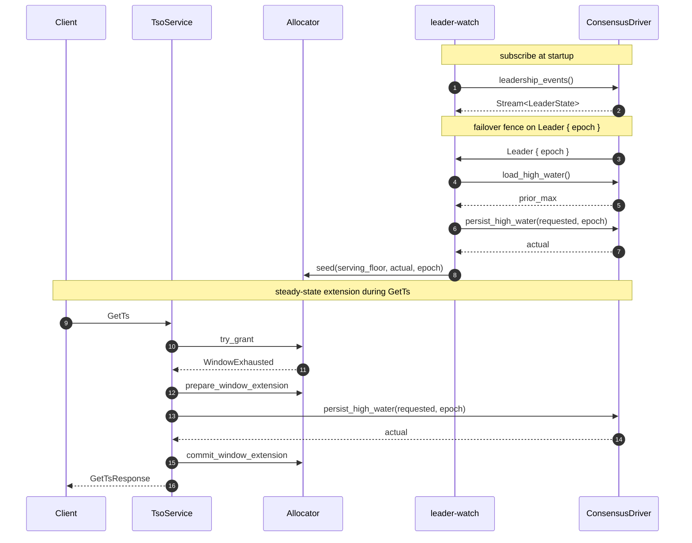

# Consensus Integration

`ConsensusDriver` is tsoracle's single pluggable trait — implement it and you can run tsoracle on top of openraft, raft-rs, etcd, or any other replicated log. This chapter is both the trait reference and a how-to: each of the core methods has its own subsection covering the contract and per-driver implementation recipes (plus the two optional dense-sequence methods that back `GetSeq`), a worked end-to-end sketch, and an explanation of why single-writer is irreducible.

## The ConsensusDriver trait

The `ConsensusDriver` trait in `tsoracle-consensus` is the single injection point for HA and durable persistence. Three required methods, plus optional dense-sequence and lease methods:

- [`leadership_events`](#leadership_events) — emit leader-state transitions
- [`load_high_water`](#load_high_water) — read the durable high-water, linearized
- [`persist_high_water`](#persist_high_water) — advance the durable high-water, monotonically, fenced by epoch
- [`load_dense_seq` / `advance_dense`](#dense-sequences-optional) — *optional*: back the `GetSeq` RPC. Both default to `DenseUnsupported`; override them to serve gapless sequences.
- [`load_leases` / `persist_leases`](#leases-optional) — *optional*: back the lease RPCs. Both default to `LeasesUnsupported`; override them to make lease grants durable across failover.

Code lives in `crates/tsoracle-consensus/src/lib.rs`.

## leadership_events

Return a `Stream<Item = LeaderState>` that emits transitions for the lifetime of the driver. The first item is the current state at the time the stream is subscribed; subsequent items reflect transitions. Use `tokio::sync::watch` + `tokio_stream::wrappers::WatchStream` for the canonical implementation. The server consumes one stream per driver and holds it forever.

`LeaderState::Leader { epoch }` means this node is the elected leader at the named epoch. The epoch is opaque to the library; drivers typically map it to the consensus layer's term or lease generation. `LeaderState::Follower { leader_endpoint }` means this node is a follower; if `leader_endpoint` is `Some`, the value is the *advertised tsoracle service address* of the current leader (NOT its raft / consensus address). `LeaderState::Unknown` means the driver does not currently know who is leader (election in progress, network partition, etc.).

## load_high_water

Return the durably-persisted high-water. The read MUST be linearized — the returned value must reflect all writes that durably committed before this call started, from any prior leader at any prior epoch. This is the contract the failover fence (see [The failover fence](key-subsystems.md#the-failover-fence) and [Monotonicity proof](the-allocator.md#monotonicity-proof)) depends on.

Per-driver recipes:

- **openraft:** call `Raft::ensure_linearizable(ReadPolicy::ReadIndex)` and read the high-water field from the state machine after the barrier passes.
- **raft-rs:** issue a `ReadIndex` request, wait for the returned index to be applied, read from the state machine.
- **etcd:** read with `--consistency=l` (linearizable, the default).
- **Single-node:** read the in-memory cache or the file. No consensus means trivially linearized.

## persist_high_water

"Advance the durable high-water to at least `at_least`, return the actual value." Critical properties: monotonic-advance, durable before returning Ok, fenced by `epoch`. See [Monotonic persistence](the-allocator.md#monotonic-persistence) for why the monotonic-advance shape (rather than absolute-set) is non-negotiable.

Per-driver recipes:

- **openraft:** submit `TsoExtend { at_least, epoch }` through `Raft::client_write()`. State machine apply does `stored = max(stored, at_least)`; returns the post-apply value. Stale leaders' writes fail because openraft refuses non-leader `client_write`s.
- **raft-rs:** propose a `TsoExtend` log entry. On commit, apply does `max(stored, at_least)`. Stale leaders fail at the propose layer.
- **etcd:** transactional update: read current value, compare-and-swap with `max(current, at_least)`. The lease + revision number gives you epoch fencing.
- **Single-node:** read current value under a mutex, take max, write the record atomically (write-then-rename + dir fsync), return.

## Dense sequences (optional)

Two further methods back the `GetSeq` RPC. They are **optional**: both default to `Err(ConsensusError::DenseUnsupported)`, which `tsoracle-server` maps to gRPC `UNIMPLEMENTED`. A driver that only serves timestamps can ignore them; a driver that wants gapless sequences overrides both.

- `async fn load_dense_seq(&self, key: &SeqKey) -> Result<u64, ConsensusError>` — return the durable current value of the per-key counter, linearized (same read contract as `load_high_water`). `0` for a key that has never been advanced.
- `async fn advance_dense(&self, key: &SeqKey, count: u32, expected_epoch: Epoch) -> Result<u64, ConsensusError>` — atomically advance the counter named `key` by `count`, durably commit the advance, and return the **pre-advance** value (the block's `start`). Fenced by `expected_epoch` exactly like `persist_high_water`.

The contract mirrors `persist_high_water` with one critical difference: it is **non-idempotent by construction**. `persist_high_water` is a monotonic `max`, so replaying it is harmless; `advance_dense` is a `fetch_add`, so replaying it spends a *second* block. A driver must therefore commit each advance exactly once and must **not** auto-retry a submission whose outcome is unknown — the ambiguity is propagated up to the client as `SeqUncertain` rather than resolved by re-submitting. Keep each key's counter independent, never let it regress, and never reuse an ordinal across leader transitions or restarts.

Per-driver recipes:

- **openraft:** submit an `AdvanceDense { key, count, epoch }` entry through `Raft::client_write()`; the state-machine apply reads `start = counter[key]`, sets `counter[key] += count`, and returns `start`, keyed per `key`. Shipped in [#585](https://github.com/prisma-risk/tsoracle/pull/585).
- **Single-node (file):** under the key's lock, read the counter, durably write `value + count` (write-then-rename + dir fsync), return the old value.
- **paxos / others:** leave defaulted (`DenseUnsupported`) until the per-key advance can be threaded through the log; the server answers `GetSeq` with `UNIMPLEMENTED` in the meantime.

See [Driver Comparison → Dense gapless sequences](driver-comparison.md#dense-gapless-sequences-getseq) for the support matrix and [Interface Reference → GetSeq](interface-reference.md#rpc-getseq) for the wire contract.

## Leases (optional)

Two optional methods back `AcquireLease`, `RenewLease`, and `ReleaseLease`. They default to `Err(ConsensusError::LeasesUnsupported)`, which the server maps to gRPC `UNIMPLEMENTED` for the lease RPCs. The failover fence treats an unsupported driver as an empty lease set so timestamp serving still boots normally.

- `async fn load_leases(&self) -> Result<Vec<LeaseRecord>, ConsensusError>` — return the durably committed lease set, linearized with the same read contract as `load_high_water`. The fence calls this on every leadership gain and seeds the in-memory lease table from it.
- `async fn persist_leases(&self, live: &[LeaseRecord], epoch: Epoch) -> Result<(), ConsensusError>` — atomically replace the full live lease set. The argument is absolute state, not a delta, so replay is idempotent and a release or expiry prune is just a set replacement. `epoch` fences stale proposers using the same driver-specific mechanisms as `persist_high_water`.

This differs from dense sequences: `advance_dense` is a non-idempotent fetch-add and must commit exactly once, while `persist_leases` is idempotent full-state replacement. A grant that supersedes an older lease persists both records in one full-set write, making supersession atomic. The file driver is the reference implementation: it stores a versioned, checksummed `leases` file with tmpfile fsync, rename, and directory fsync.

## Choosing a driver

Three driver crates ship in this repo, all on the same `ConsensusDriver` trait. They answer different operational questions.

| Driver | HA | Persistence durability | Partial-connectivity behavior |
| --- | --- | --- | --- |
| [`tsoracle-driver-file`](https://github.com/prisma-risk/tsoracle/tree/main/crates/tsoracle-driver-file) | No — single process, single binary. | File-backed; an `fsync` is taken on every high-water advance. | N/A (single node). |
| [`tsoracle-driver-openraft`](https://github.com/prisma-risk/tsoracle/tree/main/crates/tsoracle-driver-openraft) | Yes — raft quorum (majority of N must be reachable). | Replicated log + state machine; durability tracks the replication factor. | Standard raft: any cut that leaves the leader without majority forces a re-election. Asymmetric partial connectivity can churn leadership repeatedly. |
| [`tsoracle-driver-paxos`](https://github.com/prisma-risk/tsoracle/tree/main/crates/tsoracle-driver-paxos) | Yes — paxos quorum (majority of N). | Same replicated-log shape as openraft. | OmniPaxos's BLE election is more tolerant of asymmetric reachability — a leader still able to talk to some peers may retain leadership where a raft leader would step down. |

**Pick the file driver** for single-node demos, embedded use, or when an outage of the timestamp oracle is acceptable. It's the slowest of the three under load (fsync-per-advance) but has zero operational overhead — no cluster to deploy.

**Pick the openraft driver** when you need HA and your failure model is full partitions or process death. It's the most thoroughly exercised path in the existing examples and benchmarks; the worked example below documents the trait wiring.

**Pick the paxos driver** when you need HA and your operational environment is prone to asymmetric reachability (cross-AZ links that drop one direction, half-broken NICs, byzantine middleboxes). OmniPaxos's BLE pays a small steady-state cost for richer election logic but degrades more gracefully under conditions that would churn a raft leader.

All three drivers are interchangeable from the server's perspective — `tsoracle-server` accepts any `ConsensusDriver` impl, so swapping is a one-line change in your binary.

## Worked example: openraft

The canonical openraft integration ships in [`tsoracle-driver-openraft`](https://github.com/prisma-risk/tsoracle/tree/main/crates/tsoracle-driver-openraft). The crate provides `OpenraftDriver` (the generic `ConsensusDriver` bridge), `HighWaterStateMachine` (the state machine + postcard snapshot codec, with a pluggable `SnapshotStore` for persistence — an in-memory default plus an optional `RocksdbSnapshotStore` behind the `rocksdb-snapshot-store` feature), and the `OpenraftHighWaterHost` trait — the integration boundary.

### `OpenraftHighWaterHost` trait

The driver crate factors the openraft integration into two halves: the trait-surface + leadership-events boilerplate lives in `OpenraftDriver`, and the storage / submission semantics live behind `OpenraftHighWaterHost`. Implementing the host trait is what plugs the driver into *your* openraft. Three methods:

- `fn metrics(&self) -> WatchReceiverOf<Config, RaftMetrics<Config>>` — hand the driver the metrics watch it reads leadership transitions from. This is the only window the driver needs onto the host's raft, so the trait hands out the watch receiver directly rather than a `&Raft<C, SM>` — a piggyback host can satisfy it without its state machine matching the standalone host's.
- `async fn current_high_water(&self) -> Result<u64, ConsensusError>` — issue your read barrier, then read the high-water from your state machine. The bundled `StandaloneHost` does this with `Raft::ensure_linearizable(ReadPolicy::ReadIndex)`.
- `async fn submit_advance(&self, at_least: u64) -> Result<u64, ConsensusError>` — submit a "bump to at_least" proposal through *your* raft log and return the new high-water after apply. Bundled hosts wrap `HighWaterCommand::Advance(AdvancePayload { at_least })`; piggyback hosts wrap it in their own `AppData` envelope variant.

Two host shapes ship as worked examples:

- [`examples/openraft-standalone`](https://github.com/prisma-risk/tsoracle/tree/main/examples/openraft-standalone) uses the bundled standalone openraft wiring, which owns its own raft cluster + `HighWaterStateMachine`. Pick this when TSO gets its own cluster. The example shows the minimum bring-up through `tsoracle_standalone::build`; `LeaderHint` follower redirects resolve from the leader's `service_endpoint` in replicated openraft membership.
- [`examples/openraft-piggyback`](https://github.com/prisma-risk/tsoracle/tree/main/examples/openraft-piggyback) implements `OpenraftHighWaterHost` against a host service's existing raft (a tiny KV in the demo). Pick this when your service already runs openraft for other state. The example shows the envelope pattern: `AppData = HostCommand::{Kv(...), Tso(HighWaterCommand)}`, with both halves applied by the same state machine.

The standalone example runs with openraft's default snapshot policy because `HighWaterStateMachine` writes through to a `RocksdbSnapshotStore` sharing the same `Arc<DB>` as the log store. The piggyback example keeps `SnapshotPolicy::Never` because its custom `HostStateMachine` still holds state in memory only — once a downstream embedder persists their own SM (the same `SnapshotStore` trait shape works), they can pair persisted snapshots with the default policy.

## Single-leader requirement

Any correct TSO has at most one writer to the durable high-water at any moment. This is irreducible — concurrent writers can issue duplicate timestamps. So the `ConsensusDriver` contract implicitly requires single-writer-at-a-time. Multi-writer "consensus" implementations (CRDT, last-write-wins) are not compatible with tsoracle.
