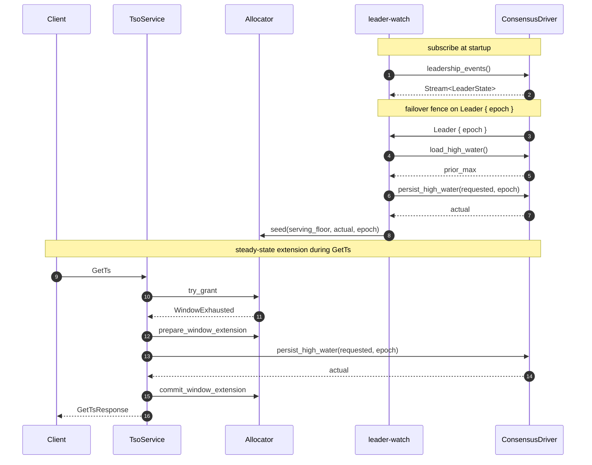

# Consensus Integration

`ConsensusDriver` is tsoracle's single pluggable trait — implement it and you can run tsoracle on top of openraft, raft-rs, etcd, or any other replicated log. This chapter is both the trait reference and a how-to: each of the three methods has its own subsection covering the contract and per-driver implementation recipes, plus a worked end-to-end sketch and an explanation of why single-writer is irreducible.



## The ConsensusDriver trait

The `ConsensusDriver` trait in `tsoracle-consensus` is the single injection point for HA and durable persistence. Three methods, about fifty lines of trait surface:

- [`leadership_events`](#leadership_events) — emit leader-state transitions
- [`load_high_water`](#load_high_water) — read the durable high-water, linearized
- [`persist_high_water`](#persist_high_water) — advance the durable high-water, monotonically, fenced by epoch

Code lives in `crates/tsoracle-consensus/src/lib.rs`.

## leadership_events

Return a `Stream<Item = LeaderState>` that emits transitions for the lifetime of the driver. The first item is the current state at the time the stream is subscribed; subsequent items reflect transitions. Use `tokio::sync::watch` + `tokio_stream::wrappers::WatchStream` for the canonical implementation. The server consumes one stream per driver and holds it forever.

`LeaderState::Leader { epoch }` means this node is the elected leader at the named epoch. The epoch is opaque to the library; drivers typically map it to the consensus layer's term or lease generation. `LeaderState::Follower { leader_endpoint }` means this node is a follower; if `leader_endpoint` is `Some`, the value is the *advertised tsoracle service address* of the current leader (NOT its raft / consensus address). `LeaderState::Unknown` means the driver does not currently know who is leader (election in progress, network partition, etc.).

## load_high_water

Return the durably-persisted high-water. The read MUST be linearized — the returned value must reflect all writes that durably committed before this call started, from any prior leader at any prior epoch. This is the contract the failover fence (see [The failover fence](key-subsystems.md#the-failover-fence) and [Monotonicity proof](the-allocator.md#monotonicity-proof)) depends on.

Per-driver recipes:

- **openraft:** call `Raft::ensure_linearizable(ReadPolicy::ReadIndex)` and read the high-water field from the state machine after the barrier passes.
- **raft-rs:** issue a `ReadIndex` request, wait for the returned index to be applied, read from the state machine.
- **etcd:** read with `--consistency=l` (linearizable, the default).
- **Single-node:** read the in-memory cache or the file. No consensus means trivially linearized.

## persist_high_water

"Advance the durable high-water to at least `at_least`, return the actual value." Critical properties: monotonic-advance, durable before returning Ok, fenced by `epoch`. See [Monotonic persistence](the-allocator.md#monotonic-persistence) for why the monotonic-advance shape (rather than absolute-set) is non-negotiable.

Per-driver recipes:

- **openraft:** submit `TsoExtend { at_least, epoch }` through `Raft::client_write()`. State machine apply does `stored = max(stored, at_least)`; returns the post-apply value. Stale leaders' writes fail because openraft refuses non-leader `client_write`s.
- **raft-rs:** propose a `TsoExtend` log entry. On commit, apply does `max(stored, at_least)`. Stale leaders fail at the propose layer.
- **etcd:** transactional update: read current value, compare-and-swap with `max(current, at_least)`. The lease + revision number gives you epoch fencing.
- **Single-node:** read current value under a mutex, take max, write the record atomically (write-then-rename + dir fsync), return.

## Worked example: openraft

```rust
// Pseudocode — adapt to your openraft TypeConfig and state machine shape.

struct OpenraftDriver {
    raft:  openraft::Raft<TypeConfig>,
    state: Arc<RwLock<StateMachine>>,
    leader_events: watch::Receiver<LeaderState>,
}

#[async_trait]
impl ConsensusDriver for OpenraftDriver {
    fn leadership_events(&self) -> Pin<Box<dyn Stream<Item = LeaderState> + Send>> {
        Box::pin(WatchStream::new(self.leader_events.clone()).boxed())
    }
    async fn load_high_water(&self) -> Result<u64, ConsensusError> {
        self.raft
            .ensure_linearizable(ReadPolicy::ReadIndex)
            .await
            .map_err(|e| ConsensusError::TransientDriver(Box::new(e)))?;
        Ok(self.state.read().high_water)
    }
    async fn persist_high_water(&self, at_least: u64, epoch: Epoch) -> Result<u64, ConsensusError> {
        let req = TsoExtend { at_least, epoch: epoch.0 };
        match self.raft.client_write(req).await {
            Ok(resp) => Ok(resp.data.persisted),
            Err(RaftError::APIError(ClientWriteError::ForwardToLeader(_))) => {
                Err(ConsensusError::NotLeader { observed: None })
            }
            Err(e) => Err(ConsensusError::TransientDriver(Box::new(e))),
        }
    }
}
```

The `leader_events` watch is populated by a separate task that consumes `Raft::metrics()` and maps `current_leader` + `state` into `LeaderState`. Mapping node IDs to advertised tsoracle endpoints is the driver's job; the library never sees raw node IDs.

For a real runnable version (with the supporting `network`, `store`, `types`, and `leader_watch` modules), see [`examples/openraft-cluster`](https://github.com/prisma-risk/tsoracle/tree/main/examples/openraft-cluster). The walkthrough is in [openraft-cluster example](testing-and-examples.md#openraft-cluster-example).

## Single-leader requirement

Any correct TSO has at most one writer to the durable high-water at any moment. This is irreducible — concurrent writers can issue duplicate timestamps. So the `ConsensusDriver` contract implicitly requires single-writer-at-a-time. Multi-writer "consensus" implementations (CRDT, last-write-wins) are not compatible with tsoracle.
