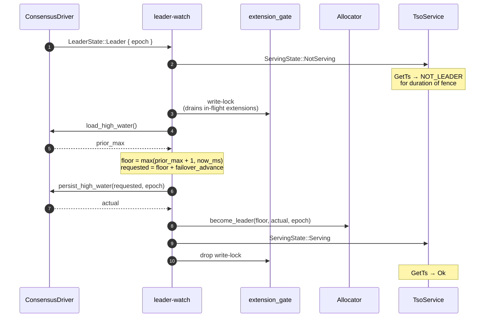

# Key Subsystems

The operational subsystems in `tsoracle-server` that wire the algorithm crate to the network. This chapter pairs with [The Allocator](the-allocator.md): that one covers *what* the algorithm is, this one covers *how* the server actually runs it. Four subsystems: the leader-watch pipeline, the failover fence, the leader-hint gRPC trailer, and how window extensions fire during steady-state serving.

## The leader-watch pipeline

The server runs one long-lived task per process — `run_leader_watch` — that consumes the `Stream<Item = LeaderState>` returned by `ConsensusDriver::leadership_events()`. Every event the driver yields drives a deterministic side-effect sequence on the allocator and on the server's `ServingState`. The service path can also force a step-down when `persist_high_water` returns `NotLeader` or `Fenced`; that emergency transition uses the same "clear allocator, then publish NotServing" ordering as the watch task.

The driver reports three variants:

- **`Leader { epoch }`** — this node is the elected leader at `epoch`. The pipeline runs the [failover fence](#the-failover-fence): clear serving, drain in-flight extensions, load the durable high-water, persist the requested advance, seed the allocator, then publish `Serving`. Until the fence completes, `GetTs` returns `NOT_LEADER`.
- **`Follower { leader_endpoint }`** — this node is not the leader. The pipeline calls `allocator.step_down()` (which forgets any cached window so the next `try_grant` returns `NotLeader`) and publishes `ServingState::NotServing { leader_endpoint }` so the service handler can include the endpoint in the `tsoracle-leader-hint-bin` trailer. Followers reject `GetTs` immediately, with no I/O.
- **`Unknown`** — election in progress, partition, or driver-internal transient. Treated as a follower with no known leader: the allocator loses its window, `ServingState::NotServing { leader_endpoint: None }` is published. Clients seeing this trailer fall back to round-robin across configured endpoints.

The drain step on entering `Leader` is the part most worth understanding. The server holds a single `tokio::sync::RwLock` (`extension_gate`): the steady-state window-extension code path in `service.rs` acquires a *read* lock for the entire `prepare → persist_high_water → commit` sequence, and the leader-watch task acquires a *write* lock immediately after clearing `ServingState`. Acquiring the write lock blocks until every read lock from the prior epoch has been dropped, so the new fence's `load_high_water` cannot race a stale `persist_high_water` still in flight from the previous leader. This is what makes the [monotonicity proof](the-allocator.md#monotonicity-proof) hold under realistic concurrency: any stale persist call either committed before the fence load (and is visible to it) or was dropped by the allocator's epoch check on return.

The task exits cleanly when the upstream `leadership_events` stream ends (driver shutdown). A consensus error *during* the fence is classified rather than uniformly fatal: a recoverable `TransientDriver` error is retried with bounded backoff (the node is still the elected leader; if the retry budget is exhausted the fence steps down to `NotServing` and awaits the next leadership event), and a `NotLeader`/`Fenced` error steps down to `NotServing` and awaits the next event — none of these tear the server down, and serving stays `NotServing` until a fence attempt fully succeeds, so the "never publish `Serving` at a stale epoch" invariant holds throughout. Only a permanent error (`PermanentDriver`) or an allocator-invariant violation terminates the task; it then poisons serving state before returning and `Server::serve_with_shutdown` shuts tonic down gracefully while surfacing the error. The task also stops on cooperative cancellation: `Server::into_router` returns a `WatchGuard` that owns the task, so embedders keep it alive while their routes serve and drop it (or call `WatchGuard::shutdown().await`) at their own shutdown — dropping signals the task to stop at its next await boundary, never mid-fence, and publishes `NotServing` before it returns.

## The failover fence

On every transition into `Leader { epoch }`, the server runs a mandatory failover fence before it begins serving `GetTs`. The fence's purpose and correctness argument are in [Monotonicity proof](the-allocator.md#monotonicity-proof); this section is the *what the server does* counterpart.

Steps, in order:

1. **Clear serving.** The server rejects `GetTs` with `NOT_LEADER` for the entire duration of the fence.
2. **Drain in-flight extensions.** Any in-progress `persist_high_water` from a prior epoch is awaited (or its result discarded) before continuing.
3. **Linearized load.** Call `ConsensusDriver::load_high_water`. The driver MUST guarantee this read reflects all writes durably committed at any prior epoch — see [load_high_water](consensus-integration.md#load_high_water).
4. **Compute the serving floor and requested ceiling.** `serving_floor = max(prior_max + 1, now_ms)`, then `requested = serving_floor + failover_advance`.
5. **Durable persist at the new epoch.** Call `ConsensusDriver::persist_high_water(requested, epoch)`. The returned value is the actual persisted high-water.
6. **Seed the allocator** with `serving_floor`, the returned high-water, and the epoch.
7. **Begin serving.**

The library refuses `GetTs` with `NOT_LEADER` for the entire duration of the fence. This makes the safety argument trivial: the new leader's first issued timestamp is strictly above the persisted bound, which was the upper bound any prior leader could have served.



## The leader-hint trailer

When a follower receives a `GetTs` or `GetSeq` RPC, it responds with `FAILED_PRECONDITION` (`Status::failed_precondition("not leader")`) carrying a binary metadata trailer keyed `tsoracle-leader-hint-bin`. The trailer's value is a protobuf-encoded `LeaderHint`:

```protobuf
message LeaderHint {
  optional string leader_endpoint = 1;
  optional EpochWire leader_epoch = 2;
}

message EpochWire {
  uint64 hi = 1;
  uint64 lo = 2;
}
```

The 128-bit leader epoch travels as a nested `EpochWire` (two 64-bit halves, `hi` more significant) rather than two top-level `optional uint64` fields, so its presence implies *both* halves: the hint carries a complete epoch or none, and a half-populated (corrupt) epoch is unrepresentable on the wire.

`leader_endpoint` is the *advertised tsoracle service address* of the current leader — the gRPC endpoint a client should retry against — not the underlying raft / consensus node ID. The driver provides this via [`LeaderState::Follower { leader_endpoint }`](consensus-integration.md#leadership_events); mapping consensus node IDs to advertised tsoracle endpoints is the driver's job, and the library never sees raw node IDs.

Encoding and decoding live in `crates/tsoracle-server/src/leader_hint.rs` and `crates/tsoracle-client/src/leader_resolved.rs` respectively. The binary format is preferred over a textual one so the client can decode it without parsing the human-readable status message — important for resilience to status-string changes.

When the trailer is present, the client moves the hinted endpoint to the front of its retry worklist and immediately tries it. When absent (e.g., the server itself only knows `LeaderState::Unknown`), the client falls back to round-robin across its configured endpoints. The full client-side algorithm is in [Leader discovery and retries](client-api-and-usage.md#leader-discovery-and-retries).

The hinted endpoint is wire input from a contacted peer, so it is treated with less trust than operator-supplied configuration. When the client was built with `ClientBuilder::tls_config(...)`, an explicit `http://...` hint is dropped (and logged at `warn` level under the `tracing` feature); the retry surfaces the underlying `FAILED_PRECONDITION` instead. This prevents a malicious or misconfigured peer from downgrading a TLS-configured client onto a plaintext leader. Bare-host hints (`host:port`) are still rewritten under the configured scheme rule and dialed; explicit `https://...` hints are honored. See [Leader-hint trailers (wire input)](client-api-and-usage.md#leader-hint-trailers-wire-input) for the full matrix.

## Steady-state window extension

During steady-state serving, a `get_ts` call that finds the allocator's `physical_ms` window exhausted joins a single-flight extension path before retrying. Concurrent callers serialize on `extension_lock`; the first caller persists a new high-water, and later callers recheck the allocator before touching consensus so a stampede normally produces one extension, not one extension per waiter. The path in `tsoracle-server/src/service.rs`:

1. `try_grant` returns `CoreError::WindowExhausted` — the current high-water `H` no longer covers `now_ms`.
2. The service handler calls `extend_window`, taking `extension_lock` so only one extender runs the persist path at a time.
3. After acquiring the lock, the handler rechecks `would_grant`; if a peer already extended enough room for this request, it returns without contacting consensus.
4. The handler takes a *read* lock on `extension_gate` to coordinate with the [leader-watch pipeline](#the-leader-watch-pipeline).
5. The allocator's `prepare_window_extension` (sync) computes `requested = max(H + 1, now_ms) + window_ahead`.
6. The handler `await`s `ConsensusDriver::persist_high_water(requested, epoch)` — this is the fsync point, and where elapsed wall time is mostly spent.
7. `commit_window_extension` (sync) applies the returned actual durable value to the allocator's in-memory bound.
8. `try_grant` is retried; a second `WindowExhausted` is treated as a driver bug (`Status::internal`).

The cost shape is **one fsync per extension, amortized over `window_ahead_ms × throughput` timestamps** — with `window_ahead = 3s` (the default) at 100 000 requests/sec, that's roughly one fsync per 300 000 timestamps. During a boundary stampede, waiters queue behind the single-flight lock and retry against the same newly committed window. Sizing `window_ahead` to bound the fraction of requests that pay this latency is covered in [Sizing window_ahead](operations.md#sizing-window_ahead).

The `prepare → commit` shape (rather than holding the allocator mutex across `await`) is what lets concurrent `get_ts` calls continue serving from the existing window while one of them is mid-extension. See [Prepare-commit split](the-allocator.md#prepare-commit-split) for the rationale.

## Serving GetSeq

`GetSeq` shares the serving gate and the leader-hint trailer with `GetTs`: a follower rejects it with the same `FAILED_PRECONDITION` + `tsoracle-leader-hint-bin` redirect, and the failover fence's `NotServing` window blocks it exactly as it blocks `GetTs`. What it does *not* share is the window-extension machinery. There is no per-request window to exhaust and no `extension_gate` read-lock to take: the handler validates the key and `count` against `tsoracle-core`, reads the current leader epoch, and `await`s `ConsensusDriver::advance_dense(key, count, epoch)` directly, returning the block's `start`.

The contract difference drives the error handling. A window extension is a monotonic `max`, so a stale or retried `persist_high_water` is harmless; a dense advance is a `fetch_add`, so it must commit exactly once. The server therefore maps a post-admission fault on the dense path to `INTERNAL` (the advance may already have committed) and the client treats that — and any ambiguous post-send failure — as `SeqUncertain` rather than retrying. A driver without dense support returns `UNIMPLEMENTED` here, never a disguised `NOT_LEADER`. See [Interface Reference → GetSeq](interface-reference.md#rpc-getseq).
