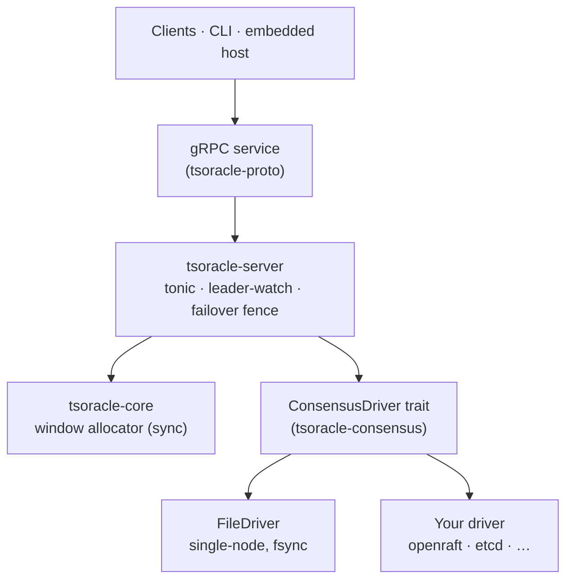

# Overview

tsoracle is a distributed timestamp oracle (TSO) for Rust — a highly available, fault-tolerant service that hands out 64-bit strictly-monotonic, gap-free integer timestamps over gRPC. It is layered: a sync algorithm core (`tsoracle-core`), an async server (`tsoracle-server`) that wires the core to the network, and a pluggable consensus surface (`ConsensusDriver`) that lets you run it single-node behind one fsync or replicated on top of a consensus library of your choice.

## What this is, and is not

tsoracle is a TSO algorithm core plus a transport. It is not a clock-synchronization system. It does not implement consensus — it consumes one through `ConsensusDriver`. It does not implement multi-shard or partitioned TSO — one tsoracle instance issues one monotonic sequence. Users wanting Spanner-style true-time, partitioned timestamp domains, or HLC fan-in should layer those concerns over tsoracle rather than expecting them inside the library.

## Where to go next

- New to TSOs or to tsoracle — start with [Getting Started](getting-started.md).
- Curious how it works internally — [Architecture Deep Dive](architecture-deep-dive.md) and [The Allocator](the-allocator.md).
- Plugging tsoracle into your own consensus — [Consensus Integration](consensus-integration.md).
- Running it in production — [Operations](operations.md).
