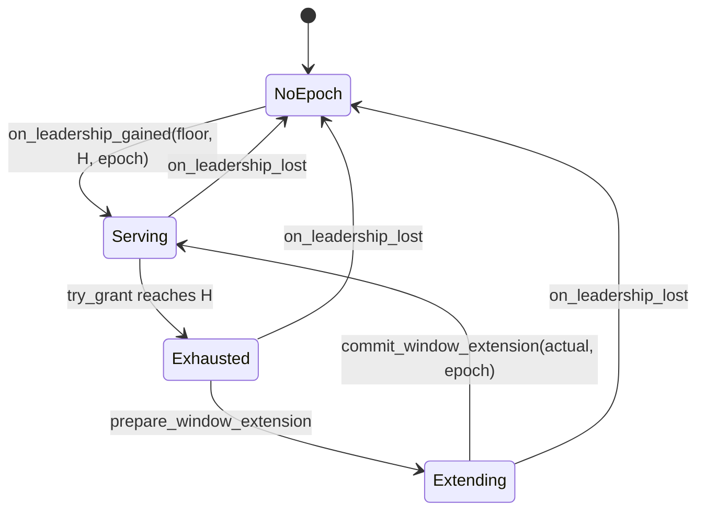

# The Allocator (Core Algorithm)

The pure algorithm that issues timestamps. This is `tsoracle-core` end-to-end: the allocation model, the prepare-commit split that keeps the core sync while the server stays async, the monotonic-advance persistence rule, and the formal monotonicity argument. [Key Subsystems](key-subsystems.md) picks up where this chapter leaves off — same algorithm, but the *orchestration* mechanics that live in the server crate.

## Allocation model

tsoracle issues 64-bit monotonic timestamps packed as `physical_ms << 18 | logical`. The high 46 bits are milliseconds since Unix epoch (good through year 4199); the low 18 bits are a logical counter that resets each time `physical_ms` advances. Maximum logical per `physical_ms` is 262 143; maximum timestamp issuance per ms is therefore 262 144 timestamps.

The allocator tracks a *committed high-water* `H` — the persisted upper bound on `physical_ms` that the durable consensus layer has accepted. The allocator will not issue any timestamp with `physical_ms > H`. When approaching exhaustion (or right after a leader transition), the allocator computes `H' = max(H + 1, now_ms) + window_ahead_ms` and asks the driver to persist `H'`. The driver's monotonic-advance semantics return the actual durable value (`max(stored, H')`), which the allocator commits as the new in-memory bound. From that point, the allocator can issue timestamps with `physical_ms` up to the new `H`.

## Prepare-commit split

Window extension is split into `prepare_window_extension` (sync, no I/O, computes the target) and `commit_window_extension` (sync, applies the persisted value after the driver returns). This split keeps the core algorithm crate sync and runtime-neutral. The server crate is the only place async lives: between `prepare` and `commit` it `await`s `driver.persist_high_water` to durably commit the new bound. Folding the persist inside `try_grant` would drag tokio into the core for a single async call; the prepare-commit shape costs about twenty lines in server glue and keeps the core property-testable in microseconds.

## Monotonic persistence

`ConsensusDriver::persist_high_water(at_least, epoch)` is "advance to at least," never "absolute set." A stale or reordered call MUST be silently absorbed without regression. This is defense in depth: even with the allocator's internal monotonicity, a buggy caller, a clock-skew event, or a racing extension cannot regress the durable high-water. The driver returns the actual persisted value so the caller learns the true state.

## Monotonicity proof

A new leader at epoch `E_new` must not issue any timestamp at or below any timestamp the prior leader at epoch `E_prev < E_new` could have issued.

tsoracle guarantees this through a mandatory failover fence run on every transition into `Leader`. The fence's role here is to give the new leader a *persisted* upper bound that strictly exceeds anything the prior leader could have served, so the new leader's first issued timestamp is unambiguously above it. The argument has three steps:

1. The driver's `load_high_water` returns a linearized read — by contract, the returned value reflects all writes that durably committed before the call started, including writes from any prior leader at any prior epoch.
2. The fence computes `serving_floor = max(prior_max + 1, now_ms)`, persists `requested = serving_floor + failover_advance` at the new epoch, and waits for the persist to durably commit before allowing the allocator to serve.
3. The allocator is seeded with both the first legal `physical_ms` (`serving_floor`) and the durable high-water `H` returned by the persist. It will not issue below `serving_floor` or above `H`, so the first timestamp from the new leader is strictly above anything any prior leader could have served.

The orchestration of the fence — drain, load, persist, seed, begin serving — is in [The failover fence](key-subsystems.md#the-failover-fence).
