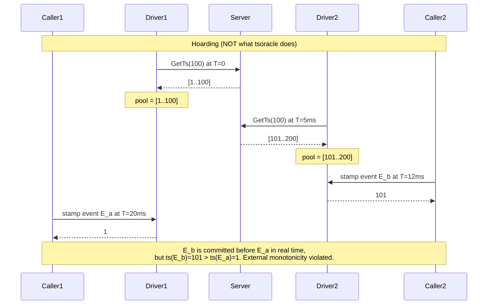
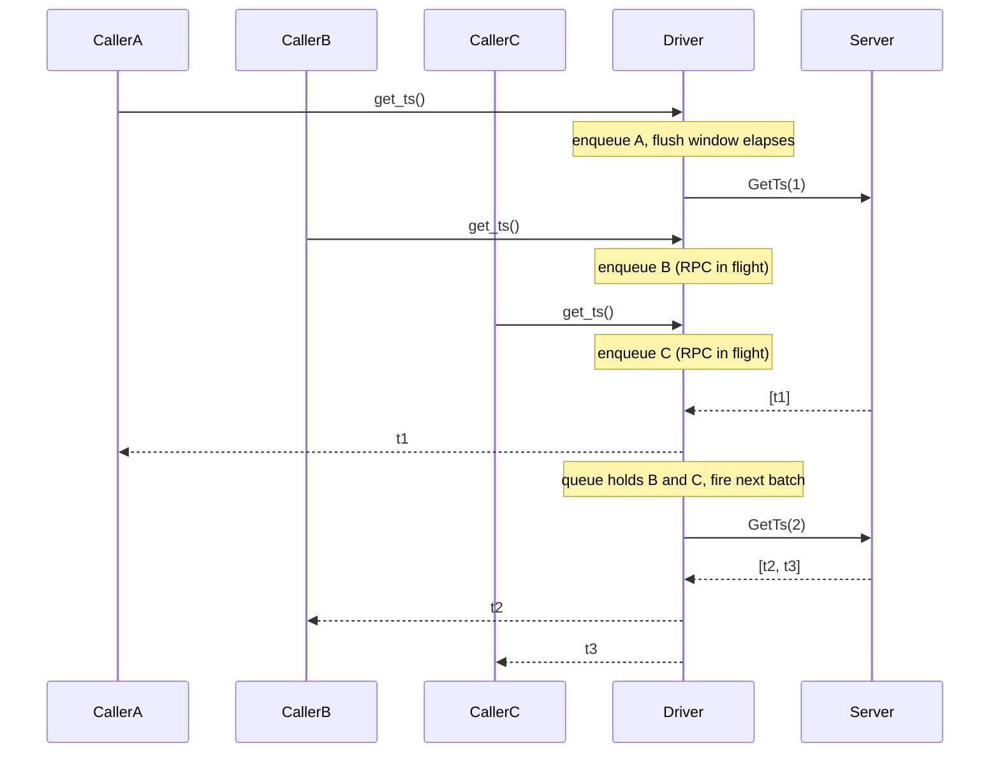

# The Client Driver (Coalescing & Freshness)

The client-side counterpart to [The Allocator](the-allocator.md). That chapter argues why a single leader hands out monotonic timestamps; this one argues why the *client* never holds an unused timestamp, what that costs, and what it buys. The contract is stated in one paragraph as the [freshness invariant](getting-started.md#the-freshness-invariant); this chapter is the why.

## Three notions of monotonicity

"Monotonic timestamps" hides three distinct guarantees, only some of which survive a batching client:

1. **Value monotonicity.** Every issued timestamp is unique and totally ordered as an integer. Trivial under any batching scheme.
2. **Per-client (per-session) monotonicity.** Successive timestamps observed by one caller are strictly increasing. Trivial: the caller walks its range in order.
3. **External (real-time) monotonicity.** If event `E_b` is committed in real time after event `E_a` was committed, then `ts(E_a) < ts(E_b)` — even when `E_a` and `E_b` are committed by different clients. This is the property MVCC visibility, snapshot isolation, and read-your-writes ultimately rest on.

A vanilla allocator with pre-fetched batches gives (1) and (2) for free. (3) is the load-bearing one and the only one that constrains client design.

## Why pre-fetching is incompatible with (3)

Two patterns sit on opposite sides of a critical line:

- **Hoarding.** The client retains an unused range of timestamps across calls. Each caller draws from a local pool that was filled by some prior RPC.
- **Coalescing.** Multiple concurrent waiters share one outgoing RPC, but every returned timestamp is delivered to one of the waiters that *contributed* to that RPC. No timestamp survives the response handler.

Hoarding breaks (3) by construction: the moment the client holds an unused timestamp `A`, the wall-clock gap between "allocator chose `A`" and "caller stamps an event with `A`" is unbounded. Other clients, with their own pools or their own RPCs, may stamp events with higher numbers during that gap. The values are still uniquely ordered as integers — they just no longer reflect real-time order.

tsoracle's client driver structurally cannot hoard. Three properties in `crates/tsoracle-client/src/driver.rs` enforce this:

1. **No leftover container.** The `Driver` struct holds an `mpsc::Sender<Waiter>` and nothing else; the `driver_task` owns a `VecDeque<Waiter>` queue but no buffer of issued-yet-unconsumed timestamps. Any timestamp that enters the task's `deliver` function exits via a waiter's `oneshot` channel before the function returns.
2. **The response iterator is consumed exactly.** `deliver` slices the RPC's response waiter-by-waiter via `iter.by_ref().take(w.count)`, with `chunk_queue` having already established that `sum(w.count) == expected`. When `deliver` returns, the iterator is exhausted and the surrounding `Vec<Timestamp>` is dropped.
3. **Long responses are protocol violations, not bonuses.** If the server ever returns more timestamps than requested, every waiter in the chunk receives `ClientError::Rpc(protocol violation)` rather than the chunk being padded into a cache. The choice is explicit and pinned by the `long_response_errors_waiters_in_chunk` test.

The first property is the architectural commitment; the other two are the maintenance burden — every refactor of `deliver` has to leave them intact, or hoarding sneaks back in through a "let's reuse the extras" branch.

## Four ways to reconcile batching with external monotonicity

The pre-fetch problem is fundamental — any system that wants both batched RPCs and external monotonicity must pick how to pay for it. Four options exist; tsoracle is option (a).

**(a) Do not pre-fetch.** Coalesce concurrent waiters into shared RPCs, but assign every timestamp at allocation time and discard nothing. Each timestamp's wall-clock gap between "minted" and "used" is bounded by half a network round-trip. This is tsoracle's choice. Cost: every timestamp the caller ever uses participates in an RPC; throughput is bounded by `batch_size / round_trip`.

**(b) Pre-fetch with commit-wait.** Let the client cache timestamps freely, but require it to wait until real wall-clock time has passed the timestamp before externalizing the stamped event. This restores (3) because any later-arriving event must request a higher timestamp at a wall-clock instant that is past the prior commit's wait. Spanner takes this route with TrueTime; the wait is sized to the clock-uncertainty window. Cost: a fixed latency tax on every commit, plus the clock-uncertainty infrastructure to bound that wait.

**(c) Pre-fetch with causal propagation (Hybrid Logical Clocks).** Each timestamp combines a physical and a logical component; whenever clients interact, they piggyback their current clock on the message and the receiver advances past it. (3) becomes *causal* rather than real-time monotonicity — for many workloads that is what was actually needed. Cost: every cross-client channel must carry clock state, and the guarantee weakens from real-time ordering to causal ordering.

**(d) Accept (1) and (2) only.** Some workloads — append-only logs, opaque identifiers, monotonic counters whose comparison semantics are irrelevant — genuinely do not need (3). Pre-fetched batches are fine, no extra mechanism required.

tsoracle's target workload — strict MVCC-style snapshot semantics on top of a single allocator — needs (3), and prefers (a) over (b) because the bounded per-timestamp RPC cost is acceptable when the server can mint 262 144 timestamps per millisecond ([Timestamp packing](architecture-deep-dive.md#timestamp-packing)) and a single coalesced RPC can carry up to a full millisecond's worth.

## The single-in-flight-RPC rule and auto-batching

`driver_task` enforces that at most one `GetTs` is in flight per `Client` at a time. While that RPC is running, new waiters arriving from concurrent callers are enqueued; when the RPC completes, the next batch fires immediately if the queue is non-empty, or the task returns to waiting for the first arrival.

This shape produces an emergent, configuration-free batching equilibrium. If callers arrive at rate λ and each round-trip takes τ, then in steady state the queue accumulates roughly `λ × τ` waiters during each RPC's lifetime, and that becomes the next RPC's batch size. The longer the RPC takes, the larger the next batch — automatically, without tuning.

Three regimes follow:

| Caller concurrency        | Steady-state batch B | Throughput      | Per-request latency |
|---------------------------|----------------------|-----------------|---------------------|
| Serial (λ small)          | ≈ 1                  | ≈ 1 / τ         | ≈ τ                 |
| Sustained (λ τ moderate)  | ≈ λ τ                | ≈ λ             | ≈ τ                 |
| Saturated (λ τ ≥ 262 144) | 262 144 (per-RPC cap)| ≈ 262 144 / τ   | grows with queue    |

The serial-caller row is the throughput floor: a caller that issues `get_ts()` one at a time, awaits each result, then issues the next, gets one RPC per request no matter what knobs are turned. The cure is more caller concurrency, not more aggressive flushing — see the next section.

## The `flush_interval` knob

`batch_flush_interval` (default 1 ms, set via `ClientBuilder::batch_flush_interval`) is a *cold-start* coalescing window. Its only effect is on the first RPC after the driver task has been idle: it delays that RPC by up to `flush_interval` so other waiters arriving in the window can pile into the same batch.

It has *no effect* on steady-state batch size. Once a single RPC is in flight, the in-flight-window auto-batching above takes over: every arriving waiter joins the next batch, regardless of `flush_interval`. The knob's per-request latency cost is paid every time the driver returns to the idle state — for sustained traffic, that is essentially never.

Two practical consequences:

- **Lowering `batch_flush_interval` to `Duration::ZERO`** removes the cold-start coalescing window. Single-shot callers on a quiet driver pay one less millisecond of latency; bursty callers may issue more RPCs than necessary during the very first burst before the in-flight rule kicks in. For most production workloads with non-trivial sustained traffic, ZERO is fine.
- **Raising `batch_flush_interval`** widens the cold-start window but does *not* increase steady-state batches. It taxes every first-after-idle request with a wall-clock wait. There is rarely a workload where this is a net win.

This is the inversion of the natural intuition that "more aggressive flushing" should help under low batch sizes. Under tsoracle's design, low batch size is a *concurrency* problem, not a *flushing* problem.

## Per-client throughput and multi-client scaling

Auto-batching is per-client — each `Client` instance runs its own `driver_task` with its own queue. There is no cross-client coalescing on the client side, because clients are different processes. Two scaling regimes follow:

- **Inside one client.** Throughput scales with caller concurrency up to the per-RPC cap. A single application sharing one `Arc<Client>` across many tasks gets the full benefit of auto-batching.
- **Across many clients.** Each client issues its own stream of RPCs to the server. Per-client throughput is bounded by `B / τ` for whatever B that client's concurrency produces; total system throughput is the sum across clients, capped by what the server can serve. The leader serves them in arrival order, and the failover fence ensures monotonicity across leader transitions ([Monotonicity proof](the-allocator.md#monotonicity-proof)).

When per-client throughput matters and the caller's logic is genuinely serial, the deployment pattern is "one shared `Client` per host, used by every in-process task," not "every callsite constructs its own `Client`."